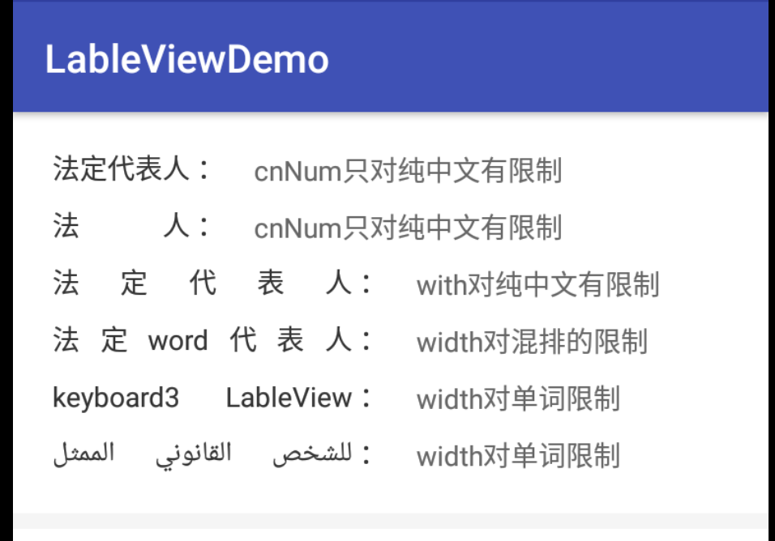

# LableView
Android Lable 文字分散两端对齐控件

## Download
* 下载 [demo.apk](./demo.apk) <br/>

## Features
* 支持末尾添加字符串不影响内容分散对齐
* 支持中文字符数量限定长度
* 支持中英文混排
* 支持多语言

## Gradle
```
compile 'com.keyboard3:LableView:1.1.1'
```

## Usage
```
 <com.keyboard3.LableView
    android:layout_width="170dp"
    android:layout_height="wrap_content"
    android:text="法定代表人"
    app:cnNum="5"
    app:endText=" ：" />
```
## Screenshot


## Thanks
* [JustifyTextView](https://github.com/EyreGe/JustifyTextView)

## Author

简书 [keyboard3](http://www.jianshu.com/users/62329de8c8a6/latest_articles)<br>
邮箱 keyboard3@icloud.com

## License
<pre>
Licensed under the Apache License, Version 2.0 (the "License");
you may not use this file except in compliance with the License.
You may obtain a copy of the License at

   http://www.apache.org/licenses/LICENSE-2.0

Unless required by applicable law or agreed to in writing, software
distributed under the License is distributed on an "AS IS" BASIS,
WITHOUT WARRANTIES OR CONDITIONS OF ANY KIND, either express or implied.
See the License for the specific language governing permissions and
limitations under the License.
</pre>
